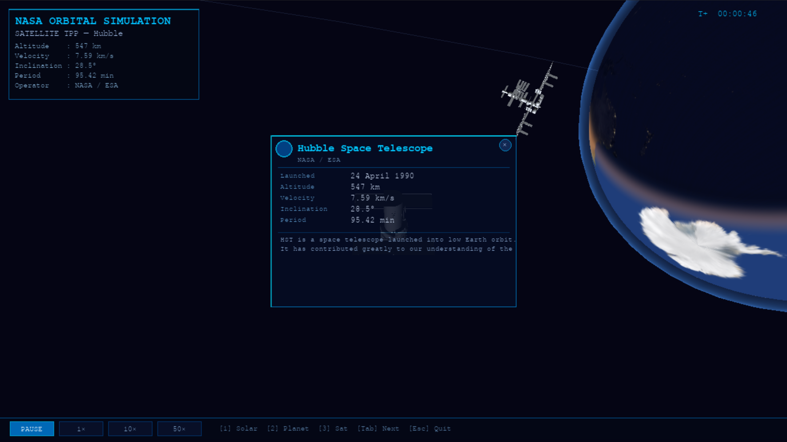
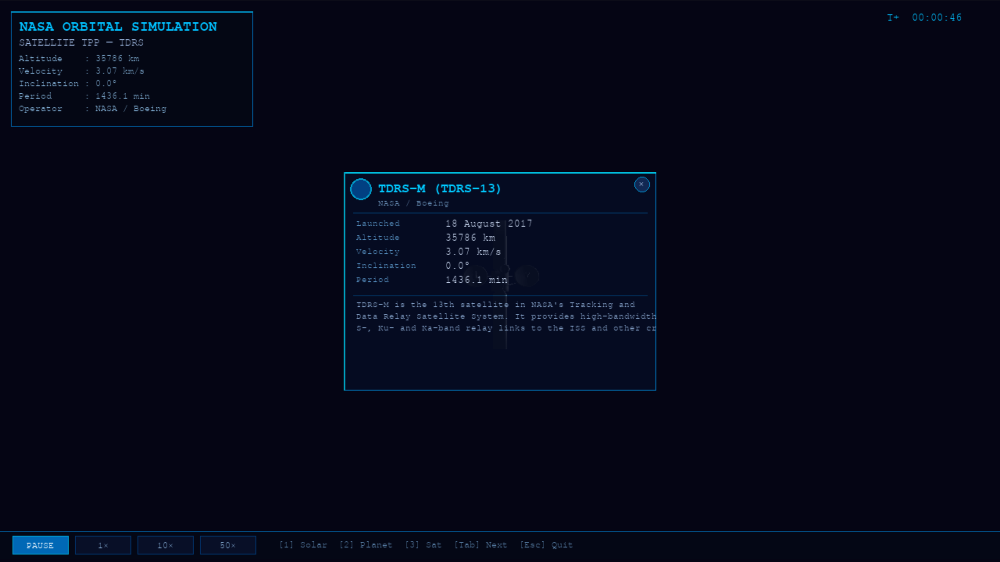

# NASA Orbital Simulation

A real-time 3D solar system simulation built with Python, PyOpenGL, and pygame. Features all 8 planets with moons and Saturn's rings, three real NASA satellites in Earth orbit, multiple camera modes, and an interactive HUD with time controls.

---

## Screenshots




---

## Features

- **Full solar system** — Mercury through Neptune, each with correct axial tilt, self-rotation, and orbital speed. Saturn includes a ring disc.
- **Moons** — Earth's Moon, Mars' Phobos and Deimos, all orbiting their parent planet.
- **Three satellites in Earth orbit** — ISS, Hubble Space Telescope, and TDRS-13 (geosynchronous). Each has accurate orbital inclination, altitude, and period data.
- **3D model support** — drop an `.obj` file in `models/` and the satellite uses it automatically. Falls back to procedural geometry if no model is present.
- **Day/night Earth shader** — soft terminator transition with city-lights on the night side and ocean specular glint.
- **Atmosphere glow** — additive rim-lighting on all planets, colour-tuned per planet (blue for Earth, orange for Mars, golden for Venus, etc.).
- **Saturn rings** — textured alpha-blended disc with Cassini Division support.
- **Pulsing Sun corona** — two-layer additive glow that breathes slowly.
- **Three camera modes** — Solar system free-rotate, Planet third-person follow, Satellite third-person follow.
- **Time controls** — PAUSE / 1× / 10× / 50× toolbar buttons rendered in the HUD.
- **Click-to-inspect** — left-click any satellite or planet to open a data popup card.
- **Orbit guide rings** — faint circles showing each planet's orbital path.
- **Pure-Python OBJ loader** — no extra dependencies beyond the base stack.

---

## Requirements

Python 3.10 or newer is recommended.

```
pip install PyOpenGL PyOpenGL_accelerate pygame Pillow numpy
```

> `PyOpenGL_accelerate` is optional but significantly improves rendering performance.

---

## Installation

```bash
git clone https://github.com/your-username/nasa-orbital-simulation.git
cd nasa-orbital-simulation
pip install PyOpenGL PyOpenGL_accelerate pygame Pillow numpy
```

Then add textures and optionally 3D models as described below, then run:

```bash
python main.py
```

---

## Project structure

```
nasa-orbital-simulation/
│
├── main.py             Entry point — event loop, GL init
├── config.py           All constants, PLANETS_DATA, SATELLITES_DATA
├── scene.py            Orchestrates all scene objects, update + draw passes
├── camera.py           Three camera modes with smooth interpolation
│
├── planet.py           Generic Planet class — all 8 planets, moons, rings
├── satellite.py        ISS / Hubble / TDRS — model or procedural fallback
├── sun.py              Sun with pulsing corona glow
├── skybox.py           Star-field background sphere
│
├── hud.py              On-screen HUD + time-control toolbar
├── info_popup.py       Click-to-inspect popup card (satellite + planet)
│
├── orbit.py            Circular orbital mechanics (position + velocity)
├── model_loader.py     Pure-Python OBJ loader, no external dependencies
├── sphere_gen.py       UV-sphere geometry generator
├── shaders.py          All GLSL shaders (Earth, Phong, rings, atmosphere, unlit)
├── texture_loader.py   PIL → OpenGL texture upload
│
├── textures/           Planet and sky textures (see Textures section)
│   ├── earth_day.png
│   ├── earth_night.png
│   ├── moon.png
│   ├── sun.png
│   ├── stars.png
│   ├── mercury.png
│   ├── venus.png
│   ├── mars.png
│   ├── jupiter.png
│   ├── saturn.png
│   ├── saturn_ring.png     (optional — transparent PNG ring map)
│   ├── uranus.png
│   └── neptune.png
│
├── models/             Optional OBJ satellite models (see Models section)
│   ├── iss.obj
│   ├── hubble.obj
│   └── tdrs.obj
│
└── docs/
    └── screenshots/    Place screenshots here
```

---

## Textures

The simulation runs without textures — every object has a solid fallback colour — but textures make a large visual difference. All sources below are free for personal and educational use.

| Texture | Recommended source |
|---|---|
| All planet surfaces (2K / 8K) | [Solar System Scope](https://www.solarsystemscope.com/textures/) |

Download each image, rename it to match the filename listed in the project structure above, and place it in `textures/`.

---

## 3D Models

Each satellite can use an OBJ model. If the file is absent the simulation automatically uses hand-coded procedural geometry — no configuration change is needed either way.

All NASA Satellites -
https://github.com/nasa/NASA-3D-Resources/tree/master/3D%20Models 

After downloading, convert to `.obj` format (online converters - `glb` to `obj`), then place the file in `models/` at the path specified by `"model"` in `SATELLITES_DATA` inside `config.py`. The loader auto-scales every model to fit a 0.4-unit bounding sphere so scale mismatches are handled automatically.

---

## Controls

| Input | Action |
|---|---|
| `1` | Switch to Solar system view |
| `2` | Switch to Planet third-person view |
| `3` | Switch to Satellite third-person view |
| `Tab` | Cycle to next planet (mode 2) or next satellite (mode 3) |
| Left-click drag | Rotate view — solar mode only |
| Scroll wheel | Zoom in / out — solar mode only |
| Left-click object | Open info popup for that satellite or planet |
| Toolbar — PAUSE | Freeze simulation time |
| Toolbar — 1× | Normal simulation speed |
| Toolbar — 10× | 10× accelerated time |
| Toolbar — 50× | 50× accelerated time |
| `Esc` | Close popup, or quit if no popup is open |

---

## Satellites

| Name | Orbit type | Inclination | Altitude | Period |
|---|---|---|---|---|
| ISS | Low Earth | 51.6° | 408 km | ~92.7 min |
| Hubble Space Telescope | Low Earth | 28.5° | 547 km | ~95.4 min |
| TDRS-13 | Geosynchronous | 0.0° | 35 786 km | ~24 h |

TDRS-13 orbits much further from Earth than ISS and Hubble and completes one orbit every 24 hours, matching Earth's rotation. In the simulation its orbit radius is set proportionally larger so it is visually distinguishable from the two LEO satellites.

---

## Architecture

```
main.py
  ├── Scene ──── Sun
  │        ├─── Planet × 8  (each owns its Moon list and optional RingDisc)
  │        └─── Satellite × 3  (ModelSatellite or FallbackXxx)
  │
  ├── Camera     3 modes, smooth lerp, ray-picking for click detection
  ├── HUD        Pygame surface rendered to a GL texture quad each frame
  └── InfoPopup  Pygame surface rendered to a GL texture quad on demand
```

Each `Planet` is instantiated from a data dict in `config.py` — there is no subclass per planet. The `Satellite` hierarchy uses a factory function (`make_satellite`) that transparently switches between an OBJ-loaded model and procedural geometry based on whether the model file exists on disk. All shaders are GLSL 1.20 (OpenGL 2.1 compatibility profile) so the simulation runs on older integrated GPUs.

---

## Extending the simulation

### Adding a satellite

1. Add an entry to `SATELLITES_DATA` in `config.py` using the same keys as the existing entries.
2. Add a `FallbackYourSat` class in `satellite.py` — copy `FallbackTDRS` and modify the geometry inside `_draw_body()`.
3. Register the new class in the `_FALLBACKS` dict at the bottom of `satellite.py`.
4. Add the name to the construction tuple in `scene.py`:
   ```python
   self.satellites = [sat_module.make_satellite(n)
                      for n in ("ISS", "Hubble", "TDRS", "YourSat")]
   ```
5. Optionally place an `.obj` file at the path set in `"model"` — it will be loaded automatically.

### Adding a planet

Add a dict to `PLANETS_DATA` in `config.py`. `scene.py` builds the planet list dynamically so no code changes are required.

Required keys: `name`, `radius`, `tilt`, `orbit_radius`, `orbit_speed`, `rot_speed`, `texture`, `rings`, `moons`, `color`.

Optional keys: `night_texture` (activates the Earth day/night shader), `ring_inner`, `ring_outer`, `ring_texture`, `phase`.

---

## Known issues

- All orbits are circular. Real planetary orbits are elliptical; adding eccentricity via the vis-viva equation is a future improvement.
- The OBJ loader does not parse `.mtl` material files — models render with the body colour from `config.py`.
- Very large OBJ files (full-detail ISS from NASA) may take a few seconds to parse on first load.
- On some Linux systems with Mesa drivers, `PyOpenGL_accelerate` can cause a segfault on exit. This is a known Mesa/PyOpenGL interaction and does not affect the simulation while it is running. Uninstalling `PyOpenGL_accelerate` resolves it.

---

## License

This project is released under the [MIT License](LICENSE).

Texture and 3D model assets sourced from NASA are in the public domain. Assets from Solar System Scope are licensed under [CC BY 4.0](https://creativecommons.org/licenses/by/4.0/) — attribution is required if you redistribute them.

---

## Acknowledgements

- [NASA 3D Resources](https://github.com/nasa/NASA-3D-Resources/tree/master/3D%20Models) — satellite and spacecraft models
- [Solar System Scope](https://www.solarsystemscope.com/textures/) — planet texture pack
- [PyOpenGL](http://pyopengl.sourceforge.net) — Python OpenGL bindings
- [pygame](https://www.pygame.org) — window management, input handling, and 2D surface rendering
